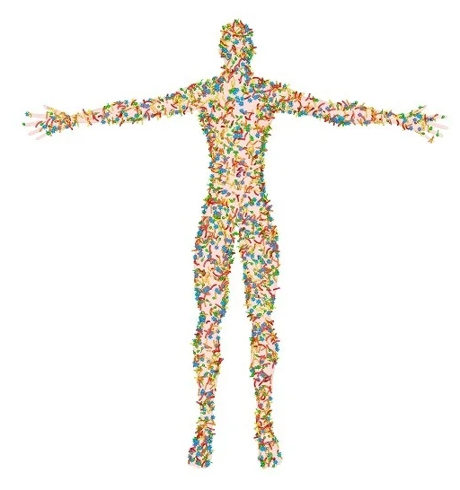

```{r setup, include=FALSE}
knitr::opts_chunk$set(echo = FALSE)

library(knitr)
```

## Cell Biology {.slide}

### 5 lectures + background reading (Campbell)

1. **Cell structure (chapter 7)**
2. Cell membranes (chapter 8)
3. Cell division (chapter 12)
4. Respiration (chapter 10)
5. Photosynthesis (chapter 11)

## Assessment

### MCQ Exam

- MCQ, 20 questions, 30 minutes
- 31st October, 16:00
- 1 week after last lecture

### Practical: Mitosis in onion root tips

- Dr. Owen Osbourne
- 27th or 28th November

## Self study

```{r, out.width = "85%", fig.align='center'}

```

## Cells are everywhere!

- Basic structural unit(s) of all organism
- Single-celled to multicellular organisms
- There are 2 types: 
  - Prokaryotic
  - Eukaryotic

## Cells are everywhere!

```{r, out.width = "80%", fig.align='center'}

```

## Cells are everywhere!

```{r, out.width = "85%", fig.align='center'}

```

## Cells are everywhere!

```{r, out.width = "100%", fig.align='center'}

```

## Cells are everywhere!

```{r, out.width = "85%", fig.align='center'}
include_graphics("./img/eyeball.svg")
```

## Prokaryotic cells

- Bacteria and Archaea
- Chromosomes, plasma membrane, cytoplasm, ribosomes
- Small (1-5um)
- DNA in nucleoid (no membrane)
- Ubiquitous in all ecosystems 

## Prokaryotic cells {.flex-cols .white-slide}

- Outnumber human cells 10:1
- ~2kg mass

```{r, out.width = "95%", fig.align='center'}

```

## Eukaryotic cells

- Animals, plants, fungi, protists
- Chromosomes, plasma membrane, cytoplasm, ribosomes
- Large (10-100 um)
- DNA in nucleus (with membrane)
- Membrane bound organelles

## Simple Eukaryotic cell diagram {.columns-2}

- Membrane
- Nucleus
- Cytoplasm
- Organelles

<br> 

```{r, out.width = "90%", fig.align='left'}

```

## Animal cell

```{r, out.width = "65%", fig.align='center'}

```

## Plant cell

```{r, out.width = "60%", fig.align='center'}

```

## Microscopy

```{r, out.width = "85%", fig.align='center'}

```

## Nucleus

```{r, out.width = "65%", fig.align='center'}

```

## Nucleus

- Large!
- Contains most of the cell’s DNA (genome)
- DNA has genes that encode proteins
- Chromosomes + proteins = chromatin
- Nuclear envelope: Double membrane with pore complex
- Allows export of messenger RNA (mRNA)

## Nucleus {.white-slide}

```{r, out.width = "70%", fig.align='center'}

```

## Endoplasmic reticulum (ER)

- Network of membranes
- Form tubules and sacs called cisternae
- The internal part of cisternae are called the ER lumen
- Separated from cytoplasm and connected to nuclear envelope
- Rough ER is studded with **ribosomes**:

  - Synthesise proteins from mRNA
  - Free and bound to endoplasmic reticulum
  - Cells that do lots of protein synthesis have lots of ribosomes

## Endoplasmic reticulum (ER) {.white-slide}

```{r, out.width = "80%", fig.align='center'}

```

## Rough and Smooth ER

### Rough ER

- Allows protein synthesis isolated from cytoplasm
- Proteins can exit the ER lumen packaged in membrane vesicles

### Smooth ER

- Important for synthesis of lipids, membrane phospholipids and hormones
- Detoxification, e.g. drugs and poisons in liver cells
- Increase in smooth ER improves detoxification (drug/alcohol tolerance)

## Golgi apparatus

```{r, out.width = "65%", fig.align='center'}

```

## Golgi apparatus {.white-slide}

- “Warehouse” for sorting and export of ER products
- Directional, with cis face receiving products from ER
- Trans face secretes products using vesicles

```{r, out.width = "75%", fig.align='center'}

```

## Lysosomes

```{r, out.width = "65%", fig.align='center'}

```

## Lysosomes

- Membraneous sac of hydrolytic enzymes
- Used to digest macromolecules
- Intracellular digestion
- Phagocytosis (e.g. within macrophage cells)
- Autophagy (recycling cell components)

## Lysosomes

```{r, out.width = "95%", fig.align='center'}

```

## Phagocytosis

```{r, out.width = "90%", fig.align='center'}

```

## Vacuole

```{r, out.width = "60%", fig.align='center'}

```

## Vacuole {.flex-cols}

- Derived from ER
- Plant and fungal cells often have a large central vacuole
- Various roles: storage of toxins, pigments, water

```{r, out.width = "80%", fig.align='center'}

```

## Mitochondria

```{r, out.width = "65%", fig.align='center'}

```

## Mitochondria

- Carry out cellular respiration
- Convert oxygen + sugar/fats to ATP
- Number correlates with cell’s metabolic activity
- Has its own small genome

## Mitochondria {.white-slide}

```{r, out.width = "90%", fig.align='center'}
include_graphics("./img/mito.png")
```

## Chloroplasts

```{r, out.width = "60%", fig.align='center'}

```

## Chloroplasts

- Photosynthesis
- Contain the chlorophyll, as well as enzymes and other molecules that function in photosynthesis
- Gives plants their green colour
- Has its own small genome

```{r, out.width = "85%", fig.align='center'}

```

## Cytoskeleton

```{r, out.width = "85%", fig.align='center'}

```

## Endosymbiont theory {.flex-cols}

- Ancestor of Eukaryotes engulfed oxygen-using and photosynthetic prokaryotes
- Became mitochondria and chloroplasts
- Double membranes
- Ribosomes
- Circular genomes (like bacteria)

```{r, out.width = "110%", fig.align='right'}

```

## Lynn Margulis {.flex-cols}

- Proposed endosymbiont theory in 1967
- After rejection from 15 journals!
- Ignored for a decade
- Demonstrated experimentally in 1978, widely accepted in 1980s based on genetics
- Numerous awards and widespread recognition

```{r, out.width = "100%", fig.align='right'}

```

## Cell Biology {.slide}

### 5 lectures + background reading (Campbell)

1. **Cell structure (chapter 7)**
2. Cell membranes (chapter 8)
3. Cell division (chapter 12)
4. Respiration (chapter 10)
5. Photosynthesis (chapter 11)

# Next time: Cell membranes

### Dr. Axel Barlow: a.barlow@bangor.ac.uk
